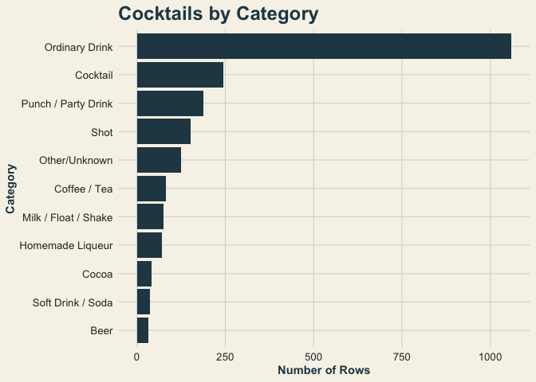

<!-- README.md is generated from README.Rmd. Please edit that file -->

``` r
library(cocktailtools)
library(dplyr)
#> 
#> Attaching package: 'dplyr'
#> The following objects are masked from 'package:stats':
#> 
#>     filter, lag
#> The following objects are masked from 'package:base':
#> 
#>     intersect, setdiff, setequal, union
library(ggplot2)
cocktails <- readr::read_csv('https://raw.githubusercontent.com/rfordatascience/tidytuesday/main/data/2020/2020-05-26/cocktails.csv')
#> Rows: 2104 Columns: 13
#> ── Column specification ────────────────────────────────────────────────────────
#> Delimiter: ","
#> chr  (8): drink, alcoholic, category, drink_thumb, glass, iba, ingredient, m...
#> dbl  (3): row_id, id_drink, ingredient_number
#> lgl  (1): video
#> dttm (1): date_modified
#> 
#> ℹ Use `spec()` to retrieve the full column specification for this data.
#> ℹ Specify the column types or set `show_col_types = FALSE` to quiet this message.
```

# cocktailtools

The goal of `cocktailtools` is to provide simple tools for exploring and
checking cocktail datasets. The package includes a data-quality helper
function and a custom `ggplot2` theme designed for cocktail-related
visualizations.

## Installation

You can install the development version of `cocktailtools` from GitHub:

``` r
pak::pak("sjk026-afk/cocktailtools")
```

# cocktailtools

The goal of `cocktailtools` is to provide simple tools for exploring and
checking cocktail datasets. The package uses the TidyTuesday cocktail
dataset and includes a data-quality helper function and a custom
`ggplot2` theme designed for cocktail-related visualizations.

## What the Package Does

`cocktailtools` includes two main functions:

- `cocktail_check()` provides a quick check of a cocktail dataset by
  reporting the number of unique cocktails and ingredients, missing
  ingredients and measurements, and duplicate rows.
- `theme_cocktail()` provides a custom `ggplot2` theme with a clean
  cocktail-inspired design for visualizations.

The package is designed to make basic data exploration easier while
giving cocktail-related visualizations a consistent appearance.

## Data Exploration

The package vignette demonstrates how `cocktailtools` can be used to
explore the cocktail dataset. The analysis uses common data manipulation
techniques including filtering, grouping and summarizing, joining,
arranging, and creating new variables with `mutate()`.

For example, the data can be grouped by ingredient to determine which
ingredients appear in the greatest number of cocktails.

## Visualization

`theme_cocktail()` can be added to a `ggplot2` visualization to give
plots a consistent appearance.

``` r
cocktails %>%
  count(category, sort = TRUE) %>%
  ggplot(aes(x = reorder(category, n), y = n)) +
  geom_col(fill = "#264653") +
  coord_flip() +
  labs(
    title = "Cocktails by Category",
    x = "Category",
    y = "Number of Rows"
  ) +
  theme_cocktail()
```


\## Design and Accessibility The package uses a customized brand.yml
file to create a consistent visual identity for cocktailtools. The color
palette uses dark teal, teal, gold, coral, and cream to create a
cocktail-inspired appearance while keeping the design clean and
readable. Darker colors are used for important text and visual elements
to improve contrast and accessibility.
